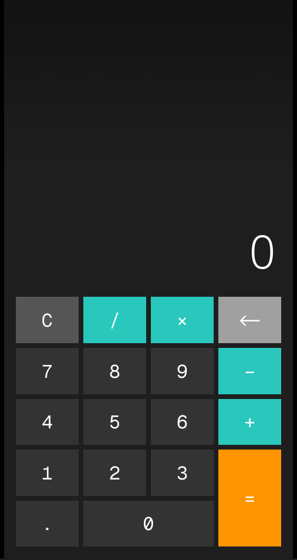

# Calculator – Beautiful Mobile-First Calculator

A clean, fast, and super smooth calculator that feels exactly like the native iPhone or Android calculator app.

**Live Demo:** https://your-username.github.io/calculator *(replace with your link after deploying)*



> Full-screen • Live preview • Smart backspace • Auto dark mode • No dependencies

## Features

- Perfect mobile experience (full-screen, safe-area support)
- Live result preview while typing — never shows "Error" during input
- Smart backspace — works perfectly after pressing `=`
- Full BODMAS/PEMDAS support with parentheses
- Auto switches to dark/light mode based on your system
- Double-tap the result to manually toggle theme
- Works 100% offline
- Pure vanilla HTML, CSS, JavaScript — zero frameworks
- Installable as PWA (Add to Home Screen)

## How to Run on Your System

### Option 1: Quickest (Just Open)

```bash
git clone https://github.com/your-username/calculator.git
cd calculator

Double-click `index.html` or drag it into any browser — works instantly!


